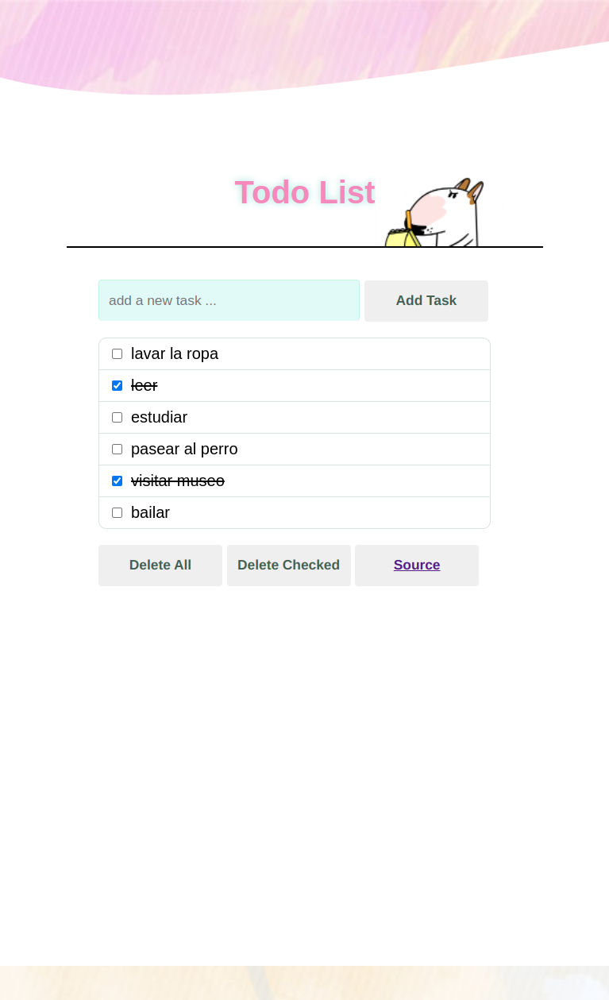
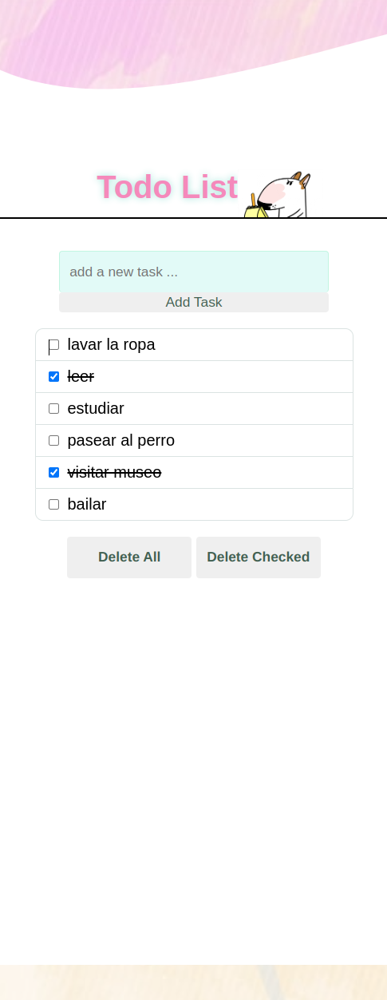

  
__________
  
 
</a>
  
 
  ## 
 Practicing with DOM 

  __________

  
</a> 
  </a>

#

- 👾 Build command:
     npm run build

- 🧐 Demo:
    https://todolistdom.netlify.app/

__________
- ⌨️ with ❤️ by [Davina](https://www.linkedin.com/in/davinamedina/) 😊